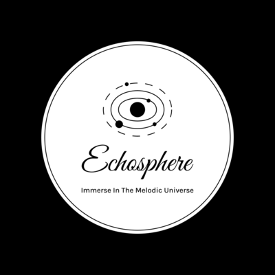

# Music Player Application



## Table of Contents

- [Description](#description)
- [Features](#features)
- [Installation](#installation)
- [Usage](#usage)
- [Technologies Used](#technologies-used)
- [Contributing](#contributing)
- [License](#license)
- [Contact](#contact)

## Description

The Music Player Application is a Python-based desktop application that allows users to play, pause, skip tracks, and adjust the volume while listening to their favourite music. The application provides an intuitive user interface, easy navigation, and visually appealing animations, making it an enjoyable and functional music player.

## Features

- Browse and add music files from the local system.
- Play, pause, stop, and resume music tracks.
- Adjust the volume with a user-friendly slider.
- Display the current playing song in the status bar.
- Visualize music playback with an animated GIF.

## Installation

1. Clone this repository to your local machine.
   ```
   git clone [https://github.com/your-username/music-player-app.git](https://github.com/Nams02/UNIcompiler.git)
   ```
2. Change to the project directory.
   ```
   cd music-player-app
   ```
3. Install the required dependencies.
   ```
   pip install -r requirements.txt
   ```

## Usage

1. Run the application using Python.
   ```
   python music_player.py
   ```
2. Click on "Browse Music" to add songs to the playlist.
3. Use the play, pause, stop, and resume buttons to control the music playback.
4. Adjust the volume using the volume slider.
5. Enjoy listening to your favourite music with visually appealing animations!

## Technologies Used

- Python
- Tkinter (GUI Library)
- Pygame (Audio Library)

## Contributing

Contributions are welcome! If you find any issues or want to enhance the application, feel free to create a pull request.

## License

This project is licensed under the [MIT License](LICENSE).

## Contact

For any questions or feedback, please feel free to reach out:

- Name: Naman Agarwal
- Email: naman101010agarwal@gmail.com
- GitHub: [Your GitHub Profile](https://github.com/Nams02)
